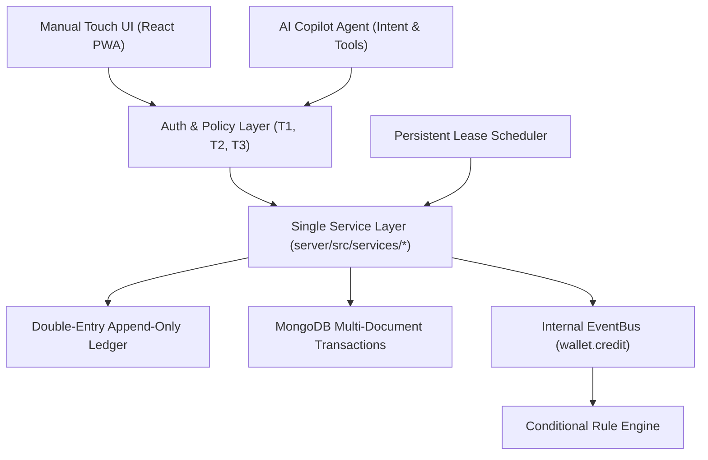

# Guardian MFS — System Architecture

Guardian MFS is a mobile financial service prototype designed for Bangladesh with an upay-inspired design language, high accessibility, and a safety-first architecture based on the core tenet: **"Two Doors, One Brain"**.

---

## 1. Architectural Philosophy: "Two Doors, One Brain"

- **Single Service Layer**: Both the React PWA touchscreen interface and the AI Agent Copilot call the exact same backend service functions in `server/src/services/*`. No financial or validation logic exists solely in routes or client components.
- **Strict Money Invariant**: All amounts are stored and processed strictly as integer minor units (`poisha`, 100 poisha = ৳1.00). Balances are guaranteed non-negative. Mutations are performed inside MongoDB transactions with idempotency keys.
- **Initial Demo Balance (৳10,000)**: All newly registered Customer and Agent accounts receive an initial ৳10,000 demo float through an auditable `initial_credit` ledger transaction.

---

## 2. Security & Policy Boundary

### Authentication Tiers
- **T1 (Session Tier)**: Bearer JWT access token (15m TTL) with refresh token rotation.
- **T2 (Step-Up Pin Tier)**: 60-second time-to-live cryptographic token generated upon verifying the 4-digit PIN, bound to a specific `actionHash` (e.g. `send-50000`). Required for all outgoing money mutations.
- **T3 (Biometric / High-Value Tier)**: WebAuthn FIDO2 passkeys for high-risk operations and limits configuration.

### LLM Safety & Isolation
- The LLM **never** directly moves money, approves limits, or decides financial risk.
- Money-moving intents produce a `PendingAction` preview card. The user must review the breakdown and authorize with their PIN.
- User input, OCR, and prompt text are screened for prompt injection heuristics. Full NIDs and PINs are strictly excluded from LLM context.
- **Number Validator**: AI transaction feedback (`AiTip`) strictly checks every number in generated text against the underlying ledger transaction facts to prevent hallucinated numbers.

---

## 3. Account Types & Ecosystem
- **CUSTOMER**: Standard consumer wallet for peer-to-peer transfers, bill payments, and automated rules.
- **AGENT**: Merchant/Agent collection point featuring:
  - Inclusion in the public **Agent Directory**.
  - 1.5% standard fee collection during Cash Out settlements.
  - Dedicated **Agent Dashboard** displaying real-time metrics, collection volume, and transaction history.

---

## 4. Automation & Scheduling
- **Generic Scheduler**: Database-persisted jobs supporting one-time, daily, weekly, and monthly executions with lease-lock claims (`runningSince`, `lockedBy`) preventing duplicate execution.
- **Conditional Rule Engine**: Subscribes to `wallet.credit` events on the internal `eventBus` to trigger automatic actions (e.g., paying utility bills or transferring to savings when salary is credited).
